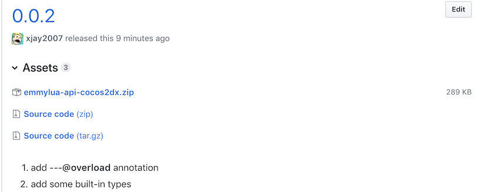

基于 [EmmyLua](https://github.com/EmmyLua/IntelliJ-EmmyLua) 插件的 [Cocos2d-x](https://github.com/cocos2d/cocos2d-x) API 提示库。

| 测试环境             |
| -------------------- |
| IntelliJ IDEA 2017.3 |
| EmmyLua Plugin1.2.4  |

## 特性

- 基于 Cocos2d-x 中 binding-generator 自动生成的 API。
- 大部分 API 提示
- `cc` , `ccui` , `ccexp` , `ccs` 等全局变量下的字段提示。
- 使用示例：

- API 示例：

  

## 安装说明

- 在 IntelliJ IDEA 中安装 [EmmyLua](https://github.com/EmmyLua/IntelliJ-EmmyLua)  插件

- 下载 [最新Release](https://github.com/xjay2007/emmylua-api-cocos2dx/releases) zip文件

  

- 打开 File -> Project Structure...

  

- Project Settings -> Libraries -> + -> Lua Zip Library 

  

- 选择下载好的zip文件，添加到当前工程

  

- 在 Project 栏可看到 External Libraries

  

## TODO

- ~~添加 `---@overload` 注解~~ v0.0.2添加
- 添加手动的 API
